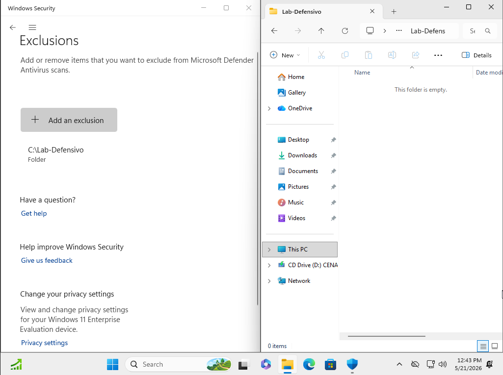
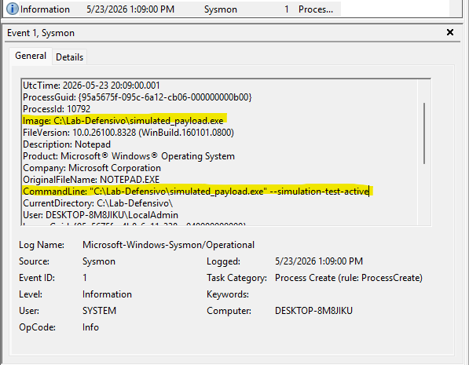
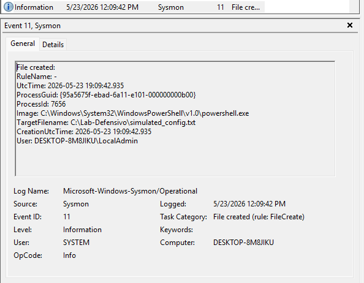
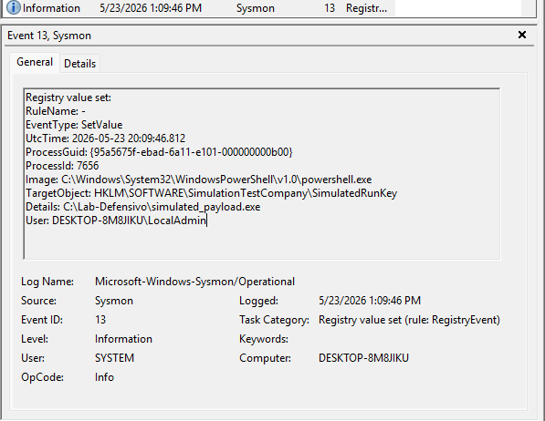
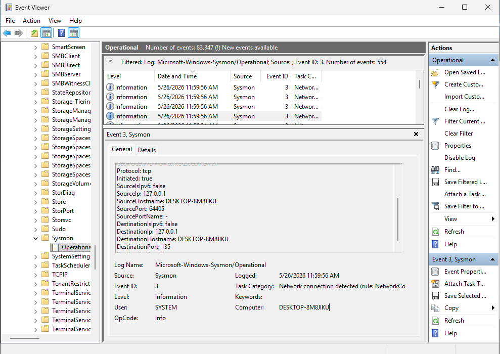
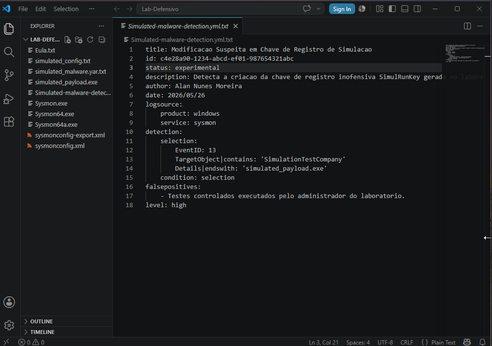

# Malware Simulation & Threat Detection Log Analysis

## 1. Project Overview
This project documents a controlled, non-malicious behavior simulation conducted within an isolated Windows 11 enterprise laboratory. The primary objective is to demonstrate a Blue Team investigative mindset by capturing endpoint telemetry, mapping actions to the MITRE ATT&CK framework, and engineering actionable detection logic (Sigma, YARA, Splunk, KQL).

> **⚠️ Operational Security Note:** This repository does not contain malicious payloads, anti-virus bypasses, or destructive code. All simulation steps utilize benign system utilities and mock administrative configurations to safely generate realistic telemetric noise for educational and defensive triage analysis.

---

## 2. Executive Summary
The simulation replicates a classic post-exploitation lifestyle: initial process execution, staging a secondary configuration file to disk, establishing persistence mechanisms, and initiating outbound network beacons. 

### Telemetry & Framework Mapping Matrix
| Observed Behavior | MITRE ATT&CK Mapping | Log Source | Severity | Target Object / Context |
| :--- | :--- | :--- | :--- | :--- |
| Binary execution from untrusted path | **T1059** - Command & Scripting Interpreter | Sysmon Event ID 1 | **Medium** | `simulated_payload.exe` |
| Dropping configuration files to disk | **T1105** - Ingress Tool Transfer | Sysmon Event ID 11 | **Medium** | `simulated_config.txt` |
| Registry manipulation for persistence | **T1547.001** - Registry Run Keys | Sysmon Event ID 13 | **High** | `SimulationTestCompany` |
| Outbound local socket beaconing | **T1071** - Application Layer Protocol | Sysmon Event ID 3 | **High** | Port `135` over `127.0.0.1` |

---

## 3. Lab Environment & Architecture
To ensure complete isolation from production infrastructure, the detection engineering workflow was built using the following stack:

| Component | Purpose / Tooling Details |
| :--- | :--- |
| **Operating System** | Windows 11 Enterprise (Isolated VM Sandbox Instance) |
| **Telemetry Agent** | Microsoft Sysmon (System Monitor) with Modular Configuration |
| **Log Management** | Windows Event Viewer (Auditing Subsystem) |
| **Execution Engine** | PowerShell Core (Administrative Console Context) |


*Figure 1: Isolated Windows 11 security monitoring workspace setup with exclusions configured.*

---

## 4. Behavioral Simulation Breakdown

### 4.1 Process Execution (Event ID 1)
A replica payload binary (`simulated_payload.exe`) was staged and executed via an interactive command-line environment to baseline process creation auditing.
* **Monitored Fields:** `Image`, `CommandLine`, `ParentImage`, `Hashes` (SHA256).


*Figure 2: Sysmon capturing process creation details and cryptographic hashes for the executing binary.*

### 4.2 File Creation (Event ID 11)
The process triggered the generation of a static configuration artifact (`simulated_config.txt`) inside the dedicated laboratory working directory.
* **Monitored Fields:** `TargetFilename`, `CreationUtcTime`, `Image`.


*Figure 3: Telemetry log confirming local disk modification and file staging patterns.*

### 4.3 Registry Modification (Event ID 13)
To simulate host persistence without making intrusive system changes, an administrative key value was written to a dedicated non-destructive registry path.
* **Monitored Fields:** `TargetObject`, `Details`, `EventType` (CreateKey / SetValue).


*Figure 4: Event ID 13 logging administrative registry modification matching persistence tactics.*

### 4.4 Network Connection (Event ID 3)
An active loopback socket request was initiated to simulate egress command-and-control beaconing traffic over common administration ports.
* **Monitored Fields:** `SourceIp`, `DestinationIp`, `DestinationPort`, `Protocol`.


*Figure 5: Network socket telemetry confirming outbound traffic monitoring capability.*

---

## 5. Indicators of Compromise (IoCs)
The following verified attributes were extracted during telemetry collection to assist in defensive signature matching:

### Host Indicators
* **File Name:** `simulated_payload.exe`
* **Staging Path:** `C:\Lab-Defensivo\simulated_payload.exe`
* **SHA256 Hash:** `3f786850e387550fdab836ed7e6dc881de23001b`
* **Registry Key:** `HKLM\SOFTWARE\SimulationTestCompany\SimulatedRunKey`

### Network Indicators
* **Destination IP:** `127.0.0.1` (Localhost Loopback validation)
* **Destination Port:** `135 / TCP`


*Figure 6: Cryptographic SHA256 validation of the laboratory executable file.*

---

## 6. Detection Engineering Artifacts

### 🟢 Sigma Rule (SIEM Agnostic Behavior Matching)
Located at: `detection/sigma/simulated-malware-detection.yml`
```yaml
title: Suspicious Simulation Registry and Process Behavioral Pattern
id: c4e28a90-1234-abcd-ef01-987654321abc
status: experimental
description: Detects registry creation/modification parameters linked to the controlled lab security simulation profile.
author: Alan Nunes Moreira
date: 2026/05/26
logsource:
    product: windows
    service: sysmon
detection:
    selection:
        EventID: 13
        TargetObject|contains: 'SimulationTestCompany'
        Details|endswith: 'simulated_payload.exe'
    condition: selection
falsepositives:
    - Controlled sandbox engineering exercises.
level: high
